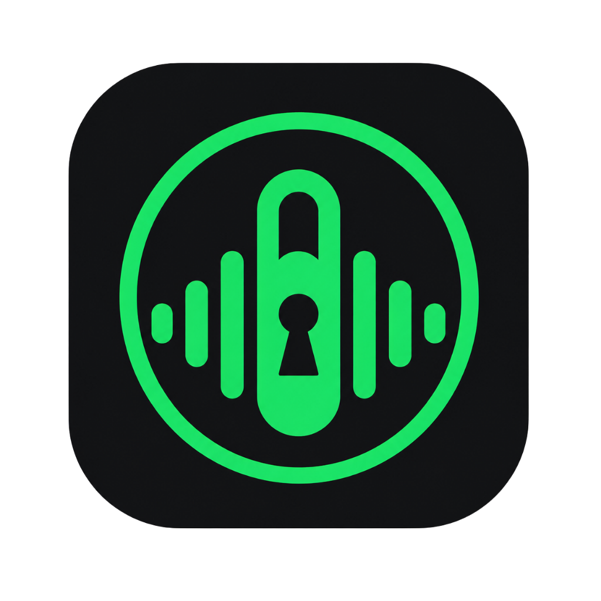

<p align="center">
  
</p>

# Music Vault

Music Vault is a standalone, local-first personal music system that transforms
authorized public or unlisted YouTube playlists into a persistent local library
with metadata, artwork, playlists, and playback.

## Current status

**v1.0.0 Release Candidate — not yet V1 Stable**

The core Windows application is established, but release-candidate correctness
and presentation work remains. Current blockers are tracked in the
[project roadmap](docs/ROADMAP.md). Music Vault is designed for personal,
local-first use; its source code is available under the [MIT License](LICENSE).

## Core capabilities

- Public and unlisted YouTube playlist synchronization through the YouTube Data API
- Full API pagination for large playlists
- Incremental acquisition based on stable YouTube video IDs
- Authorized media acquisition with yt-dlp and FFmpeg
- Persistent local library backed by SQLite
- Embedded artwork extraction and artwork display
- Album and artist browsing
- Custom local playlists
- Local playback with seek and volume controls
- Autoplay, shuffle, and repeat modes
- Temporary FIFO queue that resumes its original playback context
- Windows default audio-output following
- Local settings for the API key, download folder, and audio quality
- PyInstaller-based Windows EXE workflow with a custom icon
- Source verification, build, launch, and publication-safety tooling

Music Vault does not currently provide private-playlist OAuth, multiple source
playlists, Android support, Prime control, radio stations, AcoustID matching, or
a complete metadata editor.

## Product boundaries

Music Vault is a standalone application. It is not a Watchtower module, and
Watchtower has no planned role in the product. The existing versioned status
document is generic local infrastructure and does not create a Watchtower
runtime dependency.

Neutral interoperability with Prime is only a possible future option. A
separate Android application and personal radio system are also future
ambitions, not current features or requirements for this release candidate.

## Requirements

- Windows
- Python 3.11 for source development
- FFmpeg for synchronized-media conversion
- A YouTube Data API key for playlist synchronization

Install FFmpeg before using Sync Center and make it discoverable by FFmpeg-aware
tools, normally through `PATH`.

## Source setup

From the project root, create a project-local Python 3.11 virtual environment
and install the runtime dependencies:

```powershell
py -3.11 -m venv .venv
.\.venv\Scripts\python.exe -m pip install --upgrade pip
.\.venv\Scripts\python.exe -m pip install -r requirements.txt
```

For development and EXE build tooling, install the development requirements:

```powershell
.\.venv\Scripts\python.exe -m pip install -r requirements-dev.txt
```

Launch the source application with:

```powershell
.\tools\dev\run_source.ps1
```

## Synchronizing an authorized playlist

1. Open **Sync Center**.
2. Enter a public or unlisted YouTube playlist URL.
3. Choose a local download folder and audio-quality setting as needed.
4. Confirm that you are authorized to download the playlist content.
5. Select **Start Sync**.

Music Vault enumerates the playlist through the YouTube Data API, compares
stable video IDs with local state, acquires missing authorized items, and imports
the resulting local files into the library.

See [Authorized Use](docs/AUTHORIZED_USE.md) before using synchronization.

## Local configuration and privacy

The YouTube Data API key, database, configuration, status, artwork, archives,
and downloaded media are stored locally under the runtime data area. These files
are intentionally excluded from Git and are not part of a source checkout.

Download-folder and audio-quality choices are local settings. Never paste API
keys, private playlist details, database files, status files, or unsanitized
local paths into an issue. See [Data and Privacy](docs/DATA_AND_PRIVACY.md) and
[Security](SECURITY.md).

## Developer workflow

The PowerShell helpers resolve the project root and use the project-local
virtual environment:

```powershell
.\tools\dev\verify.ps1
.\tools\dev\pre_public_commit_check.ps1
.\tools\dev\run_source.ps1
.\tools\dev\build_exe.ps1
.\tools\dev\run_exe.ps1
.\tools\dev\run_exe_from_temp.ps1
.\tools\dev\check_status.ps1
.\tools\dev\rebuild_and_run.ps1
.\tools\dev\v1_sanity_check.ps1
```

Build the one-folder Windows application with:

```powershell
.\tools\dev\build_exe.ps1
```

Source changes require rebuilding the EXE before a desktop shortcut reflects
them. To create or update the non-admin desktop shortcut after a build, run:

```powershell
.\tools\dev\install_desktop_shortcut.ps1
```

For a direct PyInstaller invocation, use the project-local environment and the
checked-in specification:

```powershell
.\.venv\Scripts\python.exe -m PyInstaller --noconfirm --clean .\MusicVault.spec
```

See [Architecture](docs/ARCHITECTURE.md) for the current code and data flow, and
[Contributing](CONTRIBUTING.md) before proposing a change.

## Known release-candidate limitations

- Source upload dates can currently appear as release years.
- Some partial synchronization failures can be reported inaccurately.
- Manual metadata correction is not yet complete.
- The interface still requires its planned premium UI pass.
- A clean, blank V1 distribution has not yet been published.

Correction work and release ordering are tracked in
[the roadmap](docs/ROADMAP.md).

## Screenshots

Sanitized demo screenshots will be added after the premium UI and blank-demo
work. Personal-library screenshots are intentionally not included.

## License

Music Vault source code is licensed under the [MIT License](LICENSE). The source
license does not grant rights to third-party music, artwork, metadata, APIs,
websites, or services used with the application.
